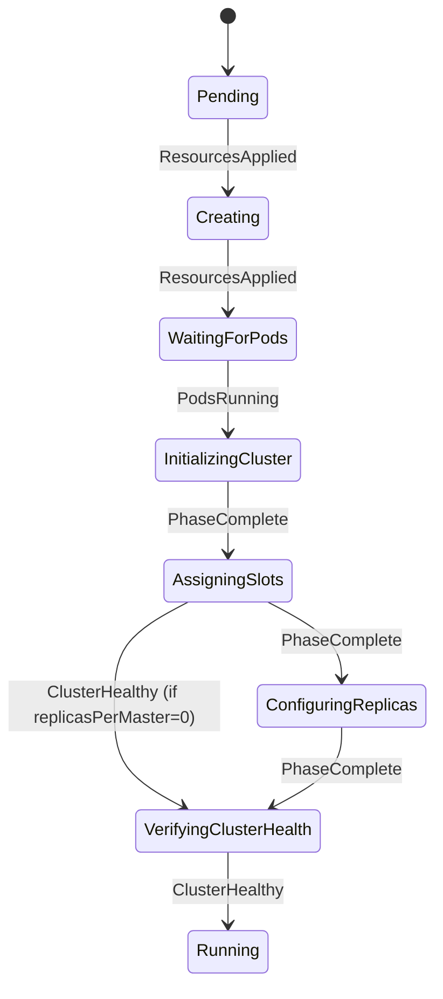
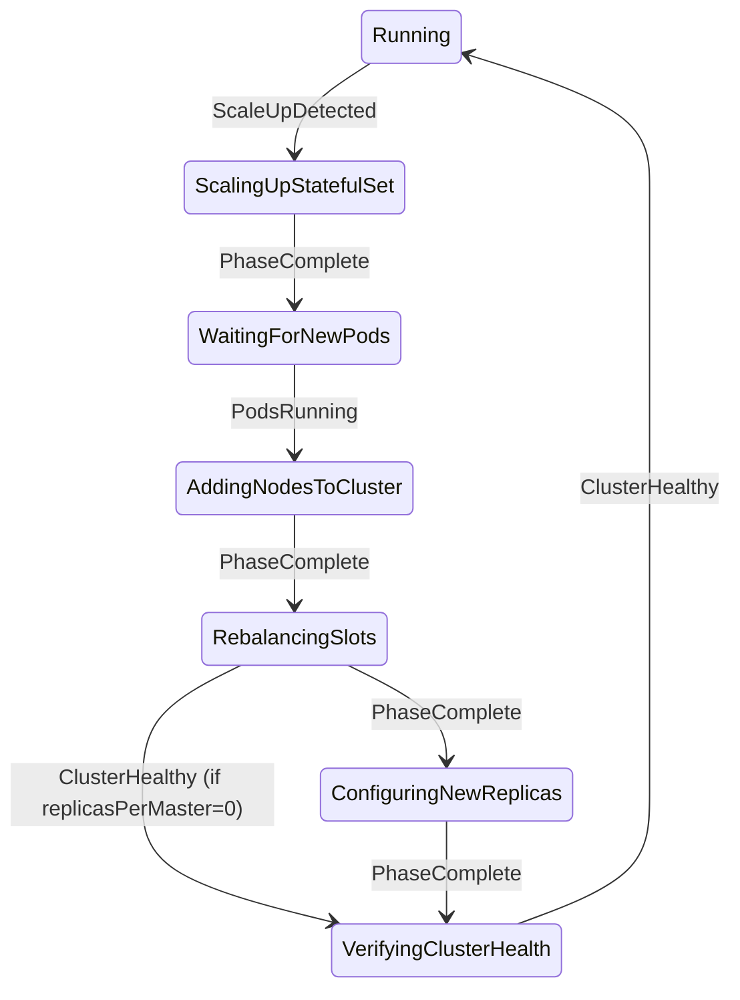
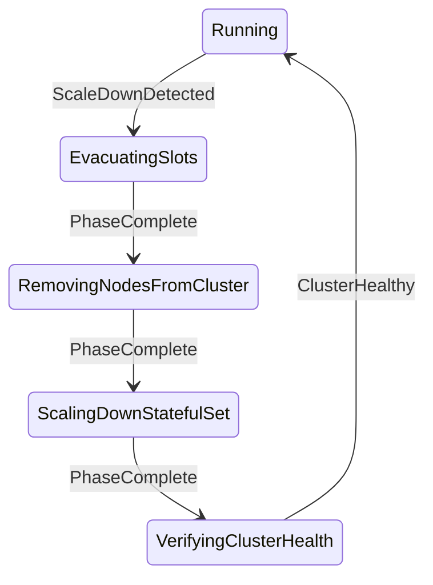
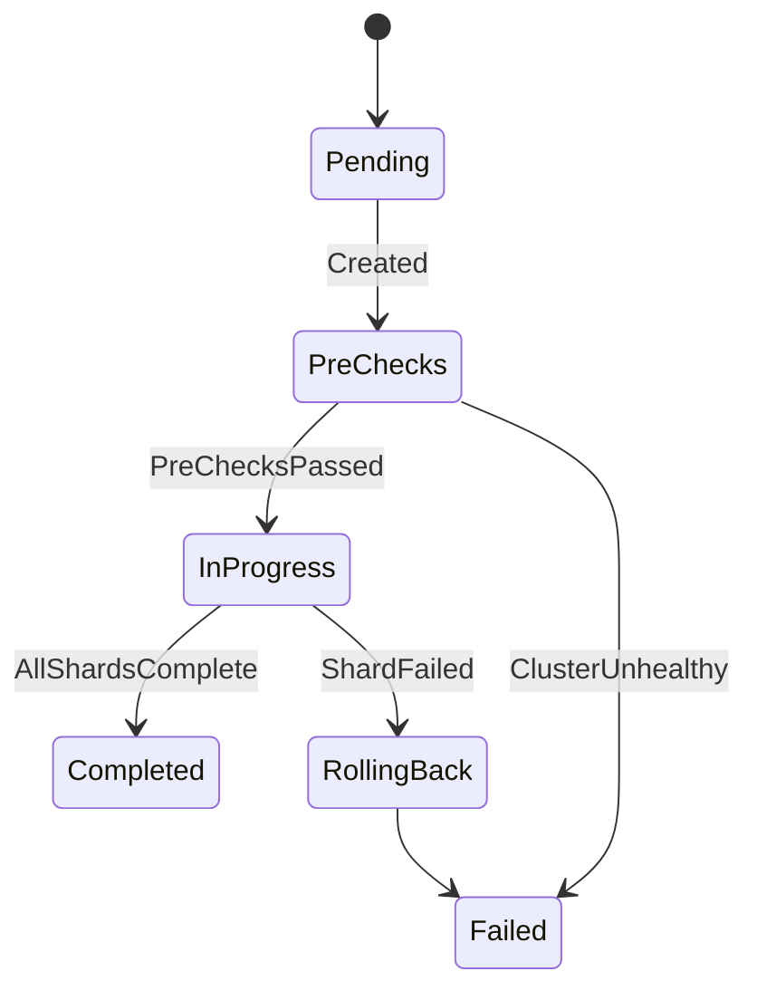
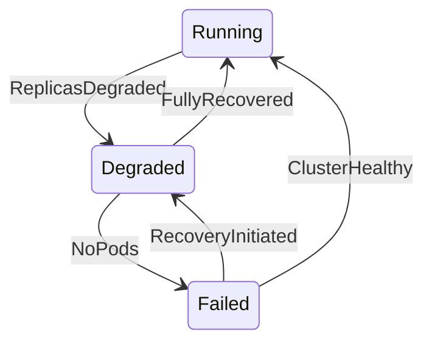

# Cluster Operations & State Machine Analysis

This document details major cluster operations with their state machine flows and analyzes correctness across different topologies.

## 1. Overview

The ValkeyCluster operator manages clusters through two state machines:
1. **Cluster State Machine** (`cluster_state_machine.rs`) - Creation, scaling, failure recovery
2. **Upgrade State Machine** (`upgrade_state_machine.rs`) - Rolling version upgrades

### ClusterPhase Enum (18 phases)

```
Initial Creation:  Pending → Creating → WaitingForPods → InitializingCluster →
                   AssigningSlots → ConfiguringReplicas
Steady State:      Running
Scale-Up:          ScalingUpStatefulSet → WaitingForNewPods → AddingNodesToCluster →
                   RebalancingSlots → ConfiguringNewReplicas
Scale-Down:        EvacuatingSlots → RemovingNodesFromCluster → ScalingDownStatefulSet
Completion:        VerifyingClusterHealth
Problem:           Degraded, Failed
Terminal:          Deleting
```

---

## 2. Operation Flows

### 2.1 New Cluster Creation



**Text Diagram:**
```
┌─────────┐  ResourcesApplied  ┌──────────┐  ResourcesApplied  ┌────────────────┐
│ Pending │ ─────────────────► │ Creating │ ─────────────────► │ WaitingForPods │
└─────────┘                    └──────────┘                    └────────────────┘
                                                                       │
                                                               PodsRunning
                                                                       ▼
┌─────────┐  ClusterHealthy  ┌───────────────────────┐  PhaseComplete  ┌─────────────────────┐
│ Running │ ◄─────────────── │ VerifyingClusterHealth│ ◄────────────── │ ConfiguringReplicas │
└─────────┘                  └───────────────────────┘                 └─────────────────────┘
     ▲                               ▲                                         ▲
     │                               │ ClusterHealthy                          │
     │                               │ (if replicasPerMaster=0)                │ PhaseComplete
     │                       ┌───────────────┐  PhaseComplete  ┌─────────────────────────┐
     │                       │ AssigningSlots│ ◄────────────── │ InitializingCluster     │
     │                       └───────────────┘                 └─────────────────────────┘
```

| Step | Phase | Handler | Valkey Commands | K8s Operations |
|------|-------|---------|-----------------|----------------|
| 1 | Pending | - | - | CR created |
| 2 | Creating | `handle_creating` | - | Create StatefulSet, Services, PDB, Certificate |
| 3 | WaitingForPods | `handle_waiting_for_pods` | - | Wait for pods phase=Running |
| 4 | InitializingCluster | `handle_initializing_cluster` | `CLUSTER MEET` | Acquire operation lock |
| 5 | AssigningSlots | `handle_assigning_slots` | `CLUSTER ADDSLOTS 0-16383` | - |
| 6 | ConfiguringReplicas | `handle_configuring_replicas` | `CLUSTER REPLICATE <master-id>` | Release operation lock |
| 7 | VerifyingClusterHealth | `handle_verifying_cluster_health` | `CLUSTER INFO` | Update status |
| 8 | Running | `handle_running` | - | Steady-state monitoring |

**Skip Path:** If `replicasPerMaster = 0`:
- AssigningSlots → VerifyingClusterHealth (via `ClusterHealthy` event)
- Skips ConfiguringReplicas entirely

**Code References:**
- `cluster_phases.rs:230-251` - `handle_creating`
- `cluster_phases.rs:257-291` - `handle_waiting_for_pods`
- `cluster_phases.rs:297-349` - `handle_initializing_cluster`
- `cluster_phases.rs:355-420` - `handle_assigning_slots`

---

### 2.2 Scale-Up Masters (e.g., 3 → 6 masters)



**Text Diagram:**
```
┌─────────┐  ScaleUpDetected  ┌───────────────────────┐  PhaseComplete  ┌──────────────────┐
│ Running │ ─────────────────►│ ScalingUpStatefulSet  │ ───────────────►│ WaitingForNewPods│
└─────────┘                   └───────────────────────┘                 └──────────────────┘
                                                                               │
                                                                        PodsRunning
                                                                               ▼
┌─────────┐  ClusterHealthy  ┌───────────────────────┐  PhaseComplete  ┌─────────────────────────┐
│ Running │ ◄─────────────── │ VerifyingClusterHealth│ ◄────────────── │ ConfiguringNewReplicas  │
└─────────┘                  └───────────────────────┘                 └─────────────────────────┘
                                    ▲                                          ▲
                                    │ ClusterHealthy                           │
                                    │ (if replicasPerMaster=0)                 │ PhaseComplete
                              ┌─────────────────┐  PhaseComplete  ┌───────────────────────┐
                              │ RebalancingSlots│ ◄────────────── │ AddingNodesToCluster  │
                              └─────────────────┘                 └───────────────────────┘
```

| Step | Phase | Handler | Detection Logic | Valkey Commands |
|------|-------|---------|-----------------|-----------------|
| 1 | Running | `handle_running` | `target_masters > current_masters` | - |
| 2 | ScalingUpStatefulSet | `handle_scaling_up_statefulset` | - | Patch StatefulSet replicas |
| 3 | WaitingForNewPods | `handle_waiting_for_new_pods` | `running_pods >= desired` | - |
| 4 | AddingNodesToCluster | `handle_adding_nodes_to_cluster` | `nodes_in_cluster < desired` | `CLUSTER MEET` |
| 5 | RebalancingSlots | `handle_rebalancing_slots` | - | `CLUSTER MIGRATESLOTS` |
| 6 | ConfiguringNewReplicas | `handle_configuring_new_replicas` | - | `CLUSTER REPLICATE` |
| 7 | VerifyingClusterHealth | `handle_verifying_cluster_health` | - | `CLUSTER INFO` |

**Node Computation:** `compute_nodes_to_add(name, current, target)` returns pods `[name-3, name-4, name-5]` for 3→6

**Code References:**
- `cluster_phases.rs:539-557` - Scale-up detection in `handle_running`
- `cluster_phases.rs:603-637` - `handle_scaling_up_statefulset`
- `cluster_phases.rs:681-732` - `handle_adding_nodes_to_cluster`
- `cluster_phases.rs:738-783` - `handle_rebalancing_slots`

---

### 2.3 Scale-Down Masters (e.g., 6 → 3 masters)



**Text Diagram:**
```
┌─────────┐  ScaleDownDetected  ┌─────────────────┐  PhaseComplete  ┌───────────────────────────┐
│ Running │ ──────────────────► │ EvacuatingSlots │ ───────────────►│ RemovingNodesFromCluster  │
└─────────┘                     └─────────────────┘                 └───────────────────────────┘
                                                                               │
                                                                        PhaseComplete
                                                                               ▼
┌─────────┐  ClusterHealthy  ┌───────────────────────┐  PhaseComplete  ┌─────────────────────────┐
│ Running │ ◄─────────────── │ VerifyingClusterHealth│ ◄────────────── │ ScalingDownStatefulSet  │
└─────────┘                  └───────────────────────┘                 └─────────────────────────┘
```

| Step | Phase | Handler | Detection Logic | Valkey Commands |
|------|-------|---------|-----------------|-----------------|
| 1 | Running | `handle_running` | `target_masters < current_masters && current > 0` | - |
| 2 | EvacuatingSlots | `handle_evacuating_slots` | - | `CLUSTER MIGRATESLOTS` (slots off masters 3,4,5) |
| 3 | RemovingNodesFromCluster | `handle_removing_nodes_from_cluster` | - | `CLUSTER FORGET` (masters + their replicas) |
| 4 | ScalingDownStatefulSet | `handle_scaling_down_statefulset` | `running_pods <= desired` | Patch StatefulSet |
| 5 | VerifyingClusterHealth | `handle_verifying_cluster_health` | - | `CLUSTER INFO` |

**Critical Invariant:** Slots MUST be evacuated BEFORE pods are deleted to prevent data loss.

**Node Computation:** `compute_nodes_to_remove(name, current, target)` returns pods `[name-3, name-4, name-5]` for 6→3

**Code References:**
- `cluster_phases.rs:487-505` - Scale-down detection in `handle_running`
- `cluster_phases.rs:838-885` - `handle_evacuating_slots`
- `cluster_phases.rs:891-930` - `handle_removing_nodes_from_cluster`

---

### 2.4 Replica-Only Changes

#### 2.4.1 Replica Scale-Up (e.g., 3m/1r → 3m/2r)

**Path:** Uses Scale-Up path with no slot movement

```
Running → ScalingUpStatefulSet → WaitingForNewPods → AddingNodesToCluster →
RebalancingSlots (no-op) → ConfiguringNewReplicas → VerifyingClusterHealth → Running
```

**Key Insight:** Replica additions go through the scale-up path because:
- StatefulSet handles replica count increase
- AddingNodesToCluster adds new replica nodes via CLUSTER MEET
- RebalancingSlots is a no-op (no new masters)
- ConfiguringNewReplicas configures replica relationships

#### 2.4.2 Replica Scale-Down (e.g., 3m/2r → 3m/1r)

**Path:** Goes directly to node removal (skipping slot evacuation since replicas don't hold slots)

```
Running → RemovingNodesFromCluster → ScalingDownStatefulSet → VerifyingClusterHealth → Running
```

**Text Diagram:**
```
┌─────────┐  ReplicaScaleDownDetected  ┌───────────────────────────┐
│ Running │ ─────────────────────────► │ RemovingNodesFromCluster  │
└─────────┘                            └───────────────────────────┘
     ▲                                             │
     │                                      PhaseComplete
     │                                             ▼
     │  ClusterHealthy  ┌───────────────────────┐  PhaseComplete  ┌─────────────────────────┐
     └──────────────────│VerifyingClusterHealth │◄────────────────│ ScalingDownStatefulSet  │
                        └───────────────────────┘                 └─────────────────────────┘
```

| Step | Phase | Handler | Valkey Commands |
|------|-------|---------|-----------------|
| 1 | Running | `handle_running` | - (detects `running_pods > desired_replicas`) |
| 2 | RemovingNodesFromCluster | `handle_removing_nodes_from_cluster` | `CLUSTER FORGET` for orphaned replicas |
| 3 | ScalingDownStatefulSet | `handle_scaling_down_statefulset` | - (patches StatefulSet) |
| 4 | VerifyingClusterHealth | `handle_verifying_cluster_health` | `CLUSTER INFO` |

**Detection Logic (cluster_phases.rs:510-532):**
```rust
// Check for replica-only scale-down (masters unchanged) BEFORE resource sync.
let desired_replicas = phase_ctx.desired_replicas();
if phase_ctx.running_pods > desired_replicas
    && phase_ctx.current_masters > 0
    && phase_ctx.current_masters == phase_ctx.target_masters
{
    // Replica scale-DOWN: go directly to node removal (skip slot evacuation)
    return Ok(ClusterPhase::RemovingNodesFromCluster.into());
}
```

**Key Insight:** Replica scale-down bypasses EvacuatingSlots because replicas don't hold slots. The `execute_forget_removed_nodes` function uses `ClusterTopology.orphaned_nodes()` to identify nodes whose IPs no longer match running pods, then issues `CLUSTER FORGET` for each orphaned node

---

### 2.5 Cluster Upgrade (Version Change)

**Separate CRD: ValkeyUpgrade**



**Text Diagram:**
```
Upgrade Phases:
┌─────────┐  Created  ┌───────────┐  PreChecksPassed  ┌────────────┐  AllShardsComplete  ┌───────────┐
│ Pending │ ────────► │ PreChecks │ ─────────────────►│ InProgress │ ──────────────────► │ Completed │
└─────────┘           └───────────┘                   └────────────┘                     └───────────┘
                            │                               │
                            │ ClusterUnhealthy              │ ShardFailed
                            ▼                               ▼
                      ┌──────────┐                    ┌─────────────┐
                      │  Failed  │◄───────────────────│ RollingBack │
                      └──────────┘                    └─────────────┘
```

**Per-Shard Upgrade Flow (sequential, one shard at a time):**

```
┌─────────┐     ┌───────────────────┐     ┌─────────────────┐     ┌─────────────┐
│ Pending │ ──► │ UpgradingReplicas │ ──► │ WaitingForSync  │ ──► │ FailingOver │
└─────────┘     └───────────────────┘     └─────────────────┘     └─────────────┘
                                                                        │
┌───────────┐     ┌─────────────────────┐     ┌──────────────────────────┐
│ Completed │ ◄── │ UpgradingOldMaster  │ ◄── │ WaitingForClusterStable  │◄┘
└───────────┘     └─────────────────────┘     └──────────────────────────┘
```

| Step | Shard State | What Happens | Commands |
|------|-------------|--------------|----------|
| 1 | UpgradingReplicas | Delete replica pods (restart with new image) | - |
| 2 | WaitingForSync | Wait for replication offset match | `INFO REPLICATION` |
| 3 | FailingOver | Promote best replica to master | `WAIT`, `CLUSTER FAILOVER` |
| 4 | WaitingForClusterStable | Verify old master is now replica | `CLUSTER INFO`, `ROLE` |
| 5 | UpgradingOldMaster | Delete old master pod | - |

**Safety Features:**
- Operation lock prevents concurrent scale/upgrade
- `upgrade-in-progress` annotation blocks ValkeyCluster spec changes
- Configurable replication sync timeout (default 300s)

**Code References:**
- `upgrade_state_machine.rs` - FSM transitions
- `upgrade_reconciler.rs` - Phase handlers
- `crd/valkey_upgrade.rs` - UpgradePhase, ShardUpgradeState enums

---

### 2.6 Failure Recovery



**Text Diagram:**
```
                    ReplicasDegraded (partial pods ready)
┌─────────┐ ─────────────────────────────────────────────► ┌──────────┐
│ Running │                                                │ Degraded │
└─────────┘ ◄────────────────────────────────────────────  └──────────┘
                    FullyRecovered / ClusterHealthy               │
                                                                  │ no pods ready
                                                                  ▼
                    ClusterHealthy                          ┌──────────┐
             ◄───────────────────────────────────────────── │  Failed  │
                                                            └──────────┘
                                                                  │
                                                                  │ RecoveryInitiated (some pods)
                                                                  ▼
                                                            ┌──────────┐
                                                            │ Degraded │
                                                            └──────────┘
```

| Condition | ready_pods | desired_pods | Result |
|-----------|------------|--------------|--------|
| Healthy | 6 | 6 | Running |
| Degraded | 3 | 6 | Degraded |
| Failed | 0 | 6 | Failed |
| Recovering | 4 | 6 | Degraded (transitioning) |

**Detection Logic (cluster_phases.rs:186-198):**
```rust
is_cluster_healthy(ready, desired) = ready >= desired && desired > 0
is_cluster_degraded(ready, desired) = ready > 0 && ready < desired
is_cluster_failed(ready) = ready == 0
```

**Automatic Recovery:** Stale IP recovery in Failed state (`cluster_reconciler.rs:490-600`):
1. Detects all pods Running but not Ready (stale nodes.conf)
2. Executes `CLUSTER MEET` with current pod IPs
3. Transitions to Degraded on success

---

## 3. Topology Analysis Matrix

### 3.1 Starting Topologies

| Name | Masters | Replicas/Master | Total Pods | Pod Names |
|------|---------|-----------------|------------|-----------|
| Minimal | 3 | 0 | 3 | vc-0, vc-1, vc-2 |
| Standard | 3 | 1 | 6 | vc-0..vc-5 (0,1,2=masters) |
| High-HA | 3 | 2 | 9 | vc-0..vc-8 (0,1,2=masters) |
| Large | 6 | 1 | 12 | vc-0..vc-11 (0-5=masters) |
| Large-HA | 6 | 2 | 18 | vc-0..vc-17 (0-5=masters) |

### 3.2 Scale Operations Analysis

| Operation | Start | End | Pods Change | Slots Moved | Path Used |
|-----------|-------|-----|-------------|-------------|-----------|
| Scale masters up | 3m/1r | 6m/1r | +6 (vc-6..vc-11) | ~8192 | Scale-Up |
| Scale masters down | 6m/1r | 3m/1r | -6 (vc-6..vc-11) | ~8192 | Scale-Down |
| Add replicas | 3m/1r | 3m/2r | +3 (vc-6..vc-8) | 0 | Scale-Up (no slot move) |
| Remove replicas | 3m/2r | 3m/1r | -3 (vc-6..vc-8) | 0 | Replica Scale-Down |
| Combined up | 3m/1r | 6m/2r | +12 | ~8192 | Scale-Up |
| Combined down | 6m/2r | 3m/1r | -12 | ~8192 | Scale-Down |

### 3.3 Potential Issues Identified

| Issue | Scenario | Current Behavior | Concern |
|-------|----------|------------------|---------|
| **Scale during degraded** | Degraded + scale-down | Allowed via state machine | May complicate recovery |
| **Rapid scale changes** | 3→6→3 masters quickly | Each transition sequential | Could leave partial state |

**Resolved Issues:**

| Issue | Resolution |
|-------|------------|
| **Replica removal path** | Replica scale-down now uses dedicated path: Running → RemovingNodesFromCluster → ScalingDownStatefulSet |
| **Missing CLUSTER FORGET** | ReplicaScaleDownDetected event routes to RemovingNodesFromCluster, which calls CLUSTER FORGET |

---

## 4. State Machine Invariants

### 4.1 Cluster State Machine

1. **Deletion from any state:** All 18 phases (except Deleting) can transition to Deleting via `DeletionRequested`
2. **No data loss on scale-down:** EvacuatingSlots MUST complete before RemovingNodesFromCluster
3. **Operation locks:** Scaling and initialization acquire locks to prevent concurrent operations
4. **Phase encodes direction:** No `pending_changes` field needed - phase name indicates scale direction

### 4.2 Upgrade State Machine

1. **Sequential shard processing:** Only one shard upgraded at a time
2. **Replica-first:** Replicas upgraded before master failover
3. **Sync verification:** Replication offset must match before failover
4. **Cluster stability:** Must verify old master recognizes it's a replica before deleting

---

## 5. File Reference

| File | Lines | Purpose |
|------|-------|---------|
| `src/controller/cluster_state_machine.rs` | 196-651 | Transition table |
| `src/controller/cluster_state_machine.rs` | 654-690 | `transition()` execution |
| `src/controller/cluster_state_machine.rs` | 740-806 | `determine_event()` |
| `src/controller/cluster_phases.rs` | 230-251 | `handle_creating` |
| `src/controller/cluster_phases.rs` | 475-593 | `handle_running` (scale detection) |
| `src/controller/cluster_phases.rs` | 603-637 | `handle_scaling_up_statefulset` |
| `src/controller/cluster_phases.rs` | 838-885 | `handle_evacuating_slots` |
| `src/controller/upgrade_reconciler.rs` | - | All upgrade handlers |
| `src/crd/valkey_cluster.rs` | 860-914 | ClusterPhase enum |

---

## See Also

- [State Machines](state-machines.md) - Phase transition diagrams
- [Features](features.md) - Feature configuration details
